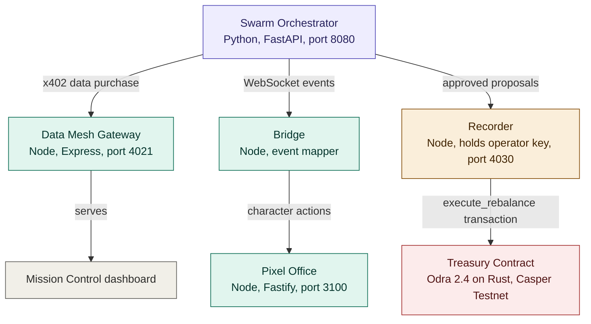

# AutonomyHQ

An autonomous AI treasury on the Casper Network.

Three AI agents manage a real treasury from end to end. They convene autonomously, decide whether market data is worth paying for, deliberate using genuine language model reasoning, sign every vote with ed25519 keys, and execute approved decisions as real transactions on Casper Testnet.

## Try it

Open the live demo: https://autonomyhq.xyz/ The demo runs on free hosting that sleeps when idle, so the first visit can take up to a minute while the services wake. If the dashboard looks empty, wait thirty seconds and refresh once.

1. Check the button in the top right. If it says START AGENTS, click it. The swarm is now live.
2. Watch the office. The three characters sit at their computers and type. Each typing character means that agent has a real task in flight.
3. Wait a few minutes, or click HUMAN OVERRIDE, CONVENE NOW to skip the wait. A meeting begins: the characters stand up from their desks, the Risk agent decides whether fresh market data justifies its price, and if it says yes a real x402 purchase happens before your eyes in the stream.
4. Read the stream on the right. Every line marked with a brain icon is genuine gpt 4o mini output, one call per agent per proposal. Agents can and do reject proposals, and a rejection blocks the chain entirely.
5. Open the On-chain view in the sidebar. Click VIEW CONTRACT to see the deployed treasury contract on cspr.live. Click any proposal row to read the signed votes. Rows that produced a transaction link straight to the public record on Casper Testnet.
6. Open the x402 view to see the payment ledger, the Feedback view to read each agent's retrospective, and press the pause button any time to halt all activity.

## What each feature does, and what is real

### Autonomous meetings

The agents meet on their own, without any human input. Meetings are triggered by a simulated market context, where things like volatility, order book depth, and position delta change over time. When the conditions are right, a meeting starts. During normal work, the characters sit at their desks and type. When a meeting begins, they stand up, and once it's over they go back to their desks. I also want to be clear about what is real here. The market signals are simulated for the demo, and the characters don't walk to a dedicated meeting area because the game engine doesn't support that. They simply leave their desks and move around. The reasoning, votes, signatures, and on-chain transactions that come from those meetings are all real.

### Real AI reasoning

Each agent has its own role: Risk, Compliance, and Treasury. Every proposal is reviewed by each agent using its own GPT-4o-mini prompt through OpenRouter.

### Agents decide when to spend

Before every discussion, the Risk agent decides whether buying fresh premium market data is actually worth it. Its decision, together with a short explanation, appears in the activity stream. If it decides yes, a complete x402 payment flow runs automatically. The gateway sends an HTTP 402 challenge, the client signs the payment using ed25519, retries the request after verification, and receives the premium market data, which is then used during the discussion. The payment protocol is real; the dataset itself is demo data served by our own gateway rather than an external vendor. When the recorder service is running, the payment is also backed by a real Casper Testnet transaction of 2.5 CSPR, while the actual protocol price remains 0.025 CSPR.

### Cryptographic accountability

Every vote is signed using ed25519 keys and verified before a proposal can be finalized. If you open any proposal in the On-chain page, you can see each agent's vote, reasoning, and signature proof.

### Real execution on Casper

When a proposal gets enough approvals, it is automatically submitted as a real transaction that calls the treasury contract's execute entry point on Casper Testnet. The contract checks quorum on-chain before allowing execution. If a proposal is rejected, nothing gets sent to the blockchain. The recorder automatically retries temporary failures and recovers from timing mismatches on its own. Manual recording is also available if needed.

### Real quorum

There are three agents, and all three must approve before anything happens. If even one agent rejects a proposal, you'll immediately see which one rejected it and why. Rejections are expected, they prove the agents are making their own decisions instead of approving everything.

### Human overrides

The agents are designed to run on their own, but you can still step in whenever you want. Two override buttons let you force a meeting or trigger a data purchase instantly, which is useful during demos. The pause button completely stops meetings, spending, and execution. Every agent shows as paused, and that state stays even after a restart.

### Agent feedback

After every meeting, each agent writes a short reflection based on the decision it just made, what it checked, what it decided, and what should be watched next. The Feedback page lets you save those entries, clear the live list, or browse previously saved feedback.

### Everything is saved

Proposal history, transactions, activity logs, feedback, and the pause state are all stored on the server. The dashboard also keeps a copy in your browser and merges both when you reopen the app, so your history survives page refreshes and even free-hosting sleep cycles. The blockchain remains the final source of truth.

### Mission Control

The dashboard brings everything together in one place. You can see the live agent cards, the pixel office, the reasoning stream, quorum status, payment counters, and signed proposals. The sidebar gives access to Dashboard, Agents, On-chain, x402, and Feedback. Social and support links are at the bottom. The portfolio values are just placeholders for the demo. Inside the office you can drag with the middle mouse button to move around, use the zoom buttons to zoom in or out, and switch to fullscreen with the square button.

## Architecture

| Service | Stack | Role |
|---|---|---|
| Swarm Orchestrator | Python, FastAPI | agents, consensus, signatures, history |
| Data Mesh Gateway | Node, Express | x402 data market, also serves the dashboard |
| Recorder | Node | holds the operator key, submits transactions |
| Pixel Office | Node, Fastify | the visual world, a fork of Pixel Agents |
| Bridge | Node | maps swarm events to character behavior |

The swarm broadcasts every event through WebSocket. The Bridge listens for those events and turns them into character actions inside the pixel office. The Recorder is the only service that interacts with the blockchain. The treasury contract is written in Rust using Odra 2.4 and keeps track of the registered agent keys together with the required quorum threshold.

## Architecture diagram



The swarm orchestrator is the brain. It runs the agents, holds the meetings, and broadcasts every event over WebSocket. The gateway sells market data through the x402 protocol and also serves the dashboard. The bridge listens to the swarm and drives the pixel office characters. The recorder is the only service that touches the blockchain, submitting transactions to the deployed contract. The contract enforces quorum on chain.

## The smart contract

The treasury contract is deployed and running on Casper Testnet.

| | |
|---|---|
| Network | Casper Testnet (casper test) |
| Contract package hash | 5f5bf585fe56fc504797a8f819aa7b2914d5ba95208a5c60a363ce57f1ccda58 |
| View the contract | https://testnet.cspr.live/contract-package/5f5bf585fe56fc504797a8f819aa7b2914d5ba95208a5c60a363ce57f1ccda58 |
| Operator account | 01b58dbd782cf6f33e240d78eec1831cf369aef257e64fc2c7e64a4c6001d8196a |
| Full transaction history | https://testnet.cspr.live/account/01b58dbd782cf6f33e240d78eec1831cf369aef257e64fc2c7e64a4c6001d8196a |
| Framework | Odra 2.4 on Rust, compiled to WebAssembly |
| Source | contracts/src/treasury.rs |

The contract keeps a registry of approved agent keys, the number of signatures required for quorum, and an operational switch. Whenever execute_rebalance is called, it records the proposal on-chain and checks that the caller is a registered agent, the protocol is active, and the required approvals have been reached. If any of those checks fail, the transaction reverts. That means quorum is enforced by the blockchain itself, not just by the application.

The contract still uses its original name, AthanorTreasury, because deployed contracts cannot be renamed after deployment. The project was renamed to AutonomyHQ during development, but every approved proposal you see in the dashboard corresponds to one of these on-chain transactions.

## Project structure

```
autonomyhq/
├── apps/
│   ├── swarm-orchestrator/        Python FastAPI swarm (the brain)
│   │   ├── main.py                server, WebSocket, autonomous meeting loop
│   │   ├── agents/
│   │   │   ├── swarm_agents.py    builds the three agents
│   │   │   ├── consensus.py       quorum, ed25519 signing and verification
│   │   │   ├── reasoning.py       real gpt 4o mini calls, decide_purchase, feedback
│   │   │   └── base.py            shared agent base class
│   │   └── requirements.txt
│   ├── data-mesh-gateway/         Node Express x402 gateway, serves dashboard
│   │   └── src/server.js
│   └── office/
│       ├── dist/cli.js            the pixel office server (fork of Pixel Agents)
│       ├── athanor-bridge.mjs     maps swarm events to office characters
│       └── mission-control/       the dashboard (index.html)
├── deploy-kit/
│   ├── deploy.mjs                 Node deployer for the contract
│   ├── chain-recorder.mjs         submits transactions, holds operator key
│   └── keys/                      operator key (gitignored, never committed)
├── contracts/
│   └── src/treasury.rs            the Odra treasury contract
├── render.yaml                    one click hosting blueprint
└── README.md
```

## Running it locally

You need Python 3.12, Node 18 or newer, and an OpenRouter API key for the real agent reasoning.

1. Clone the repo and enter it.

   ```
   git clone https://github.com/Theophilus20/autonomyhq.git
   cd autonomyhq
   ```

2. Set your OpenRouter key so the agents reason with a real model. Without it, the agents fall back to rule based logic, which is clearly labelled in the stream.

   ```
   set OPENROUTER_API_KEY=your_key_here
   ```

3. Start the swarm orchestrator.

   ```
   cd apps/swarm-orchestrator
   pip install -r requirements.txt
   python -m uvicorn main:app --host 127.0.0.1 --port 8080
   ```

4. In a new terminal, start the gateway. It also serves the dashboard.

   ```
   cd apps/data-mesh-gateway
   npm install
   node src/server.js
   ```

5. In a new terminal, start the recorder so approved proposals are written on chain.

   ```
   cd deploy-kit
   npm install
   node chain-recorder.mjs
   ```

6. In a new terminal, start the pixel office. Wait until it reports that it is running before you start the bridge, so the bridge reads the office auth token correctly.

   ```
   cd apps/office
   npm install
   node dist/cli.js --host 127.0.0.1 --port 3100
   ```

   Then, in another terminal:

   ```
   cd apps/office
   node athanor-bridge.mjs
   ```

7. Open the dashboard at the gateway address (for example `http://127.0.0.1:4021`). Within a few seconds the first meeting begins.

## Deploying the contract yourself

The contract is already live on Casper Testnet, so you do not need to deploy it to try the demo. If you want your own copy:

1. Build the contract to WebAssembly with the Odra toolchain.

   ```
   cd contracts
   cargo odra build
   ```

2. Fund a testnet account. Import `deploy-kit/keys/secret_key.pem` into Casper Wallet, connect it, and use the testnet faucet.

3. Deploy with the included Node deployer, pointing at the working testnet RPC.

   ```
   cd deploy-kit
   set NODE_URL=https://node.testnet.casper.network/rpc
   node deploy.mjs deploy ../contracts/wasm/AthanorTreasury.wasm
   ```

   The deployer prints the contract package hash. Put that hash in your dashboard config and in the recorder so they point at your contract.

## Hosting

The repo includes `render.yaml`, a Render blueprint that deploys all four services at once. In Render, choose New, then Blueprint, point it at your fork, and set two secrets: `OPENROUTER_API_KEY` and `CASPER_KEY_PEM` (the full contents of your operator key). The gateway serves the dashboard, so the gateway URL is your public link. The services run on the free tier, which sleeps when idle, so the first request after a quiet period takes a moment to wake.

## Known limitations

I prefer being clear about what is real and what is not.

The market conditions that trigger meetings are simulated, not pulled from a live market feed. The premium dataset the agents buy is served through my own gateway. The characters don't walk to a specific meeting spot because the game engine doesn't support that, and they wander around while idle as part of its built-in animation. Since the demo runs on free hosting, the services go to sleep when idle, so the first visit can take a little longer and agent activity pauses until the services wake up again. The dashboard's browser cache helps fill in those gaps in the server history.

## Roadmap

- Wallet connect so users can join as agents and sign votes with their own keys through the already deployed contract's agent registry, no code or deployment needed on their side.
- Replace the simulated market context with live market data from real price feeds and oracles.
- Build a custom version of the office engine with dedicated meeting rooms, so agents can physically gather before making decisions.
- Add multi-turn discussions between agents before voting, instead of single-round evaluations.
- Support native x402 micropayments so settlements happen at the exact protocol price.
- Add persistent hosted storage so server history remains available even after hosting sleep cycles, without relying on the browser cache.
- Add a support inbox and an AI assistant chat for users.

## Attribution

The office visuals are adapted from Pixel Agents by Pablo De Lucca, under the MIT License. See apps/office/LICENSE.pixel-agents and apps/office/ATTRIBUTION.md for details. Character and tile artwork is credited to JIK A 4 and Metro City.

## License

MIT
